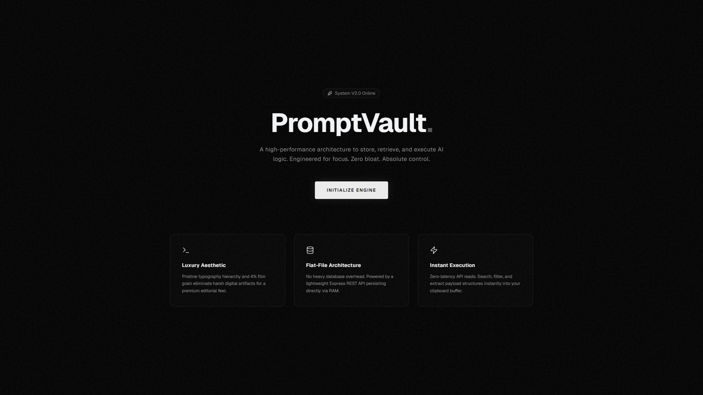
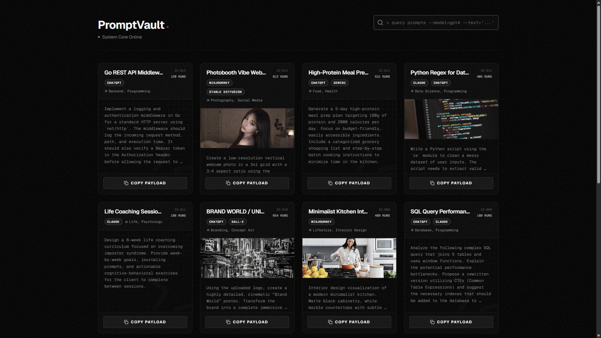

<div align="center">
<br />

# ✦ PromptVault


</div>

A premium, full-stack React application designed to store, search, and visualize AI prompts. Built with a luxurious "dark tech" aesthetic, PromptVault focuses on high performance, robust data validation, and a seamless developer experience.

## ✨ Features

- **Premium UI/UX:** Features a Vantablack (`#050505`) theme, a 4% dynamic film grain effect, Geist / Geist Mono typography, and subtle drafting grid watermarks.
- **Uniform Layout Architecture:** Enforces a strict `h-[420px]` card height across the UI, automatically scaling text structures dynamically when images are missing.
- **Deep Inspection Modal:** Utilizes a `line-clamp-4` limit on main views to preserve visual hierarchy, accompanied by a clean modal view for reading massive prompt payloads.
- **Advanced Search Engine:** Backend route architecture capable of dynamically querying strings (`title`, `prompt_text`) and deep-filtering arrays (`ai_model`, `category`).
- **Resilient Data Validation:** Powered by Zod, the backend validates incoming nested data structures dynamically, transforming legacy string structures into array types on the fly.
- **Lightweight & Portable:** Operates on a highly ephemeral, in-memory array backend. No external database configuration required.



## 🛠️ Tech Stack

### Frontend
- **Framework:** React.js
- **Styling:** Tailwind CSS + Custom CSS (Film Grain & Grid Watermarks)
- **Typography:** Geist Serif (Headers/UI) & Geist Mono (Technical Data/Payloads)
- **Icons:** Lucide React

### Backend
- **Framework:** Node.js + Express.js
- **Validation:** Zod
- **Database:** In-memory configuration (`promptRoutes.js`)

## 📂 Project Structure

```text
react-posts2/
├── backend/
│   ├── routes/
│   │   └── promptRoutes.js    # In-memory prompt storage & search logic
│   ├── validatePrompt.js      # Zod schema validation rules
│   └── server.js              # Express server entry point (Port 3001)
├── src/
│   ├── components/
│   │   └── PromptCard.jsx     # Card UI & Inspection Modal logic
│   ├── App.jsx                # Main Application view and state management
│   ├── index.css              # Global custom CSS & Grain Effects
│   └── main.jsx               # React DOM Rendering
└── README.md
```

## 🚀 Getting Started

### Prerequisites
- Node.js (v16.x or higher recommended)
- npm or yarn

### 1. Start the Backend
Navigate to the backend directory, install any dependencies, and start the local server.
```bash
cd backend
npm install
npm start
```
*The backend will initialize and listen on `http://localhost:3001`.*

### 2. Start the Frontend
In a new terminal window, navigate to the root directory, install dependencies, and start the React app.
```bash
npm install
npm start
```
*The application should now be running locally.*

## 📡 API Reference

### `GET /api/prompts`
Retrieves all prompts.
- **Query Params:** `?search=keyword` (Filters against `title`, `prompt_text`, `category`, and `ai_model`).

### `POST /api/prompts`
Creates a new prompt.
- **Body Schema (Zod):**
  ```json
  {
    "title": "String",
    "prompt_text": "String",
    "ai_model": ["String", "String"],
    "category": ["String", "String"],
    "copy_count": Number,
    "imageUrl": "URL String | null"
  }
  ```

## 👁️ Code Quality & Conventions

This project strictly adheres to maintainable principles:
- **Separation of Concerns:** Business logic (Zod) is isolated from routing logic.
- **Data Integrity:** Graceful Zod fallbacks for legacy structures ensuring UI never receives malformed data.
- **CSS Modularity:** Tailwind handles utility spacing/layout, while standard CSS handles complex aesthetic overlays (grain/watermarks).
